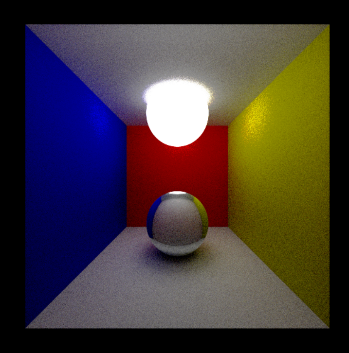

# Ray Tracing Engine

A ray Tracing Engine made in vanilla JS with WebGL
Check it out from the github pages section.
You can move the camera by draggin the mouse and clicking W A S D.

Instructions:

> Clone The project
> Open with live server in VS code or any other static web page loader
